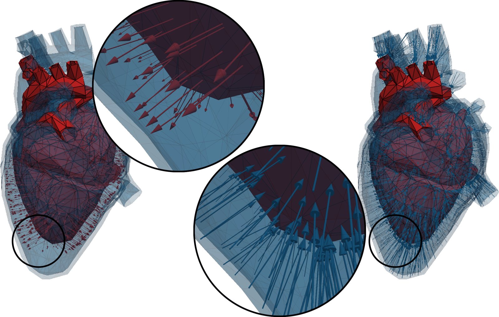

# MeshMetrics
[](https://doi.org/10.48550/arXiv.2509.05670)
[](https://doi.org/10.5281/zenodo.16896595)
[](https://pypi.org/project/pymeshmetrics/)
[](https://pypi.org/project/pymeshmetrics/)
[](https://github.com/gasperpodobnik/meshmetrics/actions/workflows/tests.yml)
[](LICENSE)

> Official Python-based implementation of `MeshMetrics` from [_MeshMetrics: A Precise Implementation of Distance-Based Image Segmentation Metrics_](https://doi.org/10.48550/arXiv.2509.05670), motivated by the implementation pitfalls identified in [_Understanding Implementation Pitfalls of Distance-Based Metrics for Image Segmentation_](https://doi.org/10.48550/arXiv.2410.02630) and [_HDilemma: Are Open-Source Hausdorff Distance Implementations Equivalent?_](https://link.springer.com/chapter/10.1007/978-3-031-72114-4_30)

## About
`MeshMetrics` is a precise, mesh-based implementation of widely used distance-based metrics for evaluating image segmentation tasks. By leveraging mesh representations of segmentation, `MeshMetrics` ensures precision in distance and boundary element size calculations. For a detailed description and a comparison with other open-source tools supporting distance-based metric calculations, see [our paper](https://doi.org/10.48550/arXiv.2509.05670).

The library supports both 2D and 3D data and works seamlessly with multiple segmentation formats (`numpy.ndarray`, `SimpleITK.Image`, `vtk.vtkPolyData`, `trimesh.Trimesh`, and `meshio.Mesh`). It also allows mixing representations between reference and predicted segmentations - for example, one input can be a mask image (`SimpleITK.Image`), while the other is a surface mesh (`vtk.vtkPolyData`/`trimesh.Trimesh`/`meshio.Mesh`). See the *Advanced usage* section in [`examples.ipynb`](examples.ipynb) for more details.

Available distance-based metrics:
- **Hausdorff distance** (HD) with $p$-th **percentile variants** (HD<sub>p</sub>)
- **Mean average surface distance** (MASD)
- **Average symmetric surface distance** (ASSD)
- **Normalized surface distance** (NSD)
- **Boundary intersection over union** (BIoU)

For convenience, `MeshMetrics` also includes implementations of the **Dice similarity coefficient** (DSC) and **intersection over union** (IoU).


*Distances between two segmentations of the heart, computed from the boundary elements of one mesh to the surface of the other (left: red → blue, right: blue → red).*

If you use `MeshMetrics` in your work, please cite:
```
Podobnik, G., & Vrtovec, T. (2025). MeshMetrics: A Precise Implementation of Distance-Based Image Segmentation Metrics. arXiv preprint arXiv:2509.05670.
Podobnik, G., & Vrtovec, T. (2025). Understanding Implementation Pitfalls of Distance-Based Metrics for Image Segmentation. arXiv preprint arXiv:2410.02630.
```

## Installation
### System Dependencies
This package requires `libxrender1` to be installed on your system. Install it via:
```bash
sudo apt update && sudo apt install -y libxrender1
```

### Install `meshmetrics` package
Install from [PyPI](https://pypi.org/project/pymeshmetrics/) with pip, or add it to your project with [uv](https://docs.astral.sh/uv/):
```bash
pip install pymeshmetrics
uv add pymeshmetrics
```
The package is published as `pymeshmetrics` and imported as `meshmetrics`:
```python
import meshmetrics
```
Optional support for `trimesh` and `meshio` inputs is available via extras: `pip install "pymeshmetrics[all]"` (or `[trimesh]` / `[meshio]`).

To install the latest development version from GitHub:
```bash
pip install git+https://github.com/gasperpodobnik/meshmetrics.git
```

### Development
Clone the repository and create the environment (including dev tools and all extras):
```bash
git clone https://github.com/gasperpodobnik/meshmetrics.git
cd meshmetrics
uv sync --all-extras
uv run pytest
```

## Usage
### Quick start
Compute all metrics for a pair of segmentations in one call:
```python
import SimpleITK as sitk
from meshmetrics import compute_metrics

ref_sitk = sitk.ReadImage("data/example_3d_ref_mask.nii.gz")
pred_sitk = sitk.ReadImage("data/example_3d_pred_mask.nii.gz")

results = compute_metrics(ref_sitk, pred_sitk, taus=(2.0, 5.0))
# {'ref_is_empty': False, 'pred_is_empty': False, 'HD_100': ..., 'HD_95': ..., 'MASD': ..., 'ASSD': ...,
#  'NSD_2.0': ..., 'NSD_5.0': ..., 'BIoU_2.0': ..., 'BIoU_5.0': ..., 'DSC': ..., 'IoU': ...}
```
`taus` are the tolerances (in physical units) for NSD and BIoU; they are application-specific, so NSD and BIoU are only computed when `taus` are given. Use `percentiles` to choose the HD variants (default `(100, 95)`) and `metrics` to select a subset, e.g. `metrics=["hd", "nsd"]`. Inputs can be any of the supported types (see below); numpy arrays and pairs of meshes also need `spacing`.

### Multi-label segmentations
For label maps with several structures (e.g. multiple organs), `compute_metrics_multilabel` computes the metrics for each label, cropping all labels in a single pass and optionally in parallel:
```python
import SimpleITK as sitk
from meshmetrics import compute_metrics_multilabel

ref_labels = sitk.ReadImage("ref_labels.nii.gz")
pred_labels = sitk.ReadImage("pred_labels.nii.gz")

results = compute_metrics_multilabel(ref_labels, pred_labels, taus=(2.0,), n_jobs=4)
# {1: {'HD_100': ..., 'DSC': ..., ...}, 2: {...}, ...}
```
By default, all non-zero labels present in either label map are evaluated; use `labels` to select specific ones. A label present in only one label map gets the values for an empty mask.

### Step-by-step
Simple usage example of `MeshMetrics` for 3D segmentation masks is shown below.
See [`examples.ipynb`](examples.ipynb) notebook for more examples.

```python
from pathlib import Path
import SimpleITK as sitk
from meshmetrics import DistanceMetrics

data_dir = Path("data")

# read binary segmentation masks
ref_sitk = sitk.ReadImage(str(data_dir / "example_3d_ref_mask.nii.gz"))
pred_sitk = sitk.ReadImage(str(data_dir / "example_3d_pred_mask.nii.gz"))

# Set parameters
percentile = 95  # percentile for HD
tau = 2.0  # tolerance for NSD and BIoU

# Initialize distance metrics class and set inputs
dist_metrics = DistanceMetrics()
dist_metrics.set_input(ref=ref_sitk, pred=pred_sitk)

# store flags indicating empty masks
results = {
    "ref_is_empty": dist_metrics.ref_is_empty,
    "pred_is_empty": dist_metrics.pred_is_empty,
}
# Hausdorff distance (HD), by default, HD percentile is set to 100 (equivalent to HD)
results["HD_100"] = dist_metrics.hd()
# p-th percentile HD (HD_p)
results[f"HD_{percentile}"] = dist_metrics.hd(percentile=percentile)
# Mean average surface distance (MASD)
results["MASD"] = dist_metrics.masd()
# Average symmetric surface distance (ASSD)
results["ASSD"] = dist_metrics.assd()
# Normalized surface distance (NSD) with tau
results[f"NSD_{tau}"] = dist_metrics.nsd(tau=tau)
# Boundary intersection over union (BIoU) with tau
results[f"BIoU_{tau}"] = dist_metrics.biou(tau=tau)

# print metric values
units = {"HD": "mm", "MASD": "mm", "ASSD": "mm", "NSD": "%", "BIoU": "%"}
for k, v in results.items():
    unit = units.get(k.split("_")[0], "")
    f = 100.0 if unit == "%" else 1.0
    print(f"{k}: {v*f:.2f} {unit}")

# ----------------------------------------
# If using `numpy.ndarray` representations, note that the spacing must be
# reordered when converting a `SimpleITK.Image` object to a `numpy.ndarray`
ref_np = sitk.GetArrayFromImage(ref_sitk).astype(bool)
pred_np = sitk.GetArrayFromImage(pred_sitk).astype(bool)

# spacing should resemble the order of numpy array axes
spacing = ref_sitk.GetSpacing()[::-1]

dist_metrics = DistanceMetrics()
dist_metrics.set_input(ref=ref_np, pred=pred_np, spacing=spacing)
# ... follow the same procedure as before
```

## Implementation pitfalls of distance-based metrics
Distance-based metrics are well defined mathematically, but their implementations are not. Open-source tools differ in how they extract the segmentation boundary from a mask, whether they weight distances by the size of the corresponding boundary elements, how they compute percentiles, and how they handle the pixel/voxel size and empty masks. As a result, different tools report different values for the same metric on the same pair of segmentations, and the differences are far from negligible: in our analysis of 11 open-source tools, they exceeded 100 mm for HD<sub>p</sub>, 40 mm for MASD, 20 mm for ASSD, and 30 percentage points for NSD and BIoU. Values computed with different tools are therefore generally not comparable, for example when comparing your results with those reported in the literature.


For details, see:
- G. Podobnik, T. Vrtovec. [_Understanding Implementation Pitfalls of Distance-Based Metrics for Image Segmentation_](https://doi.org/10.48550/arXiv.2410.02630), arXiv:2410.02630, 2025.
- G. Podobnik, T. Vrtovec. [_HDilemma: Are Open-Source Hausdorff Distance Implementations Equivalent?_](https://link.springer.com/chapter/10.1007/978-3-031-72114-4_30), MICCAI 2024.
- G. Podobnik, T. Vrtovec. [_MeshMetrics: A Precise Implementation of Distance-Based Image Segmentation Metrics_](https://doi.org/10.48550/arXiv.2509.05670), arXiv:2509.05670, 2025.
